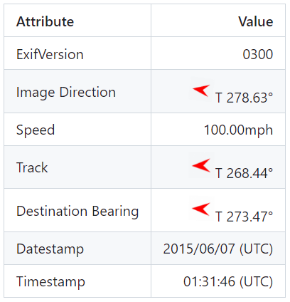

### Hi there 👋

I'm a full-stack web engineer.

I feel happy when coding.
 
My current interests: PHP, Laravel, Vue.js, Angular, Python, Golang, Mathematics and Physics.

- 🌱 I’m currently learning Angular and Golang.
- 👯 I’m looking to collaborate on somewhere.

## GitHub Stats

<p align="left">
  <a href="https://github.com/macocci7/macocci7/"></a>
  <a href="https://github.com/macocci7"></a>
</p>

<p align="left"> 

<!--
  
-->

| <a href="https://github.com/macocci7/macocci7"></a> | <a href="https://github.com/macocci7/macocci7"></a> |
| ------------- | ------------- |

</p>

## Languages and Tools

<a href="https://www.w3.org/html/" target="_blank" rel="noreferrer"></a>
<a href="https://www.w3schools.com/css/" target="_blank" rel="noreferrer"></a>
<a href="https://www.php.net" target="_blank" rel="noreferrer"></a>
<a href="https://developer.mozilla.org/en-US/docs/Web/JavaScript" target="_blank" rel="noreferrer"></a>
<a href="https://www.python.org" target="_blank" rel="noreferrer"></a>
<a href="https://go.dev/" target="_blank" rel="noreferrer"></a>
<a href="https://jquery.com/" target="_blank" rel="noreferrer"></a>
<a href="https://vuejs.org/" target="_blank" rel="noreferrer"></a>
<a href="https://www.typescriptlang.org/" target="_blank" rel="noreferrer"></a>
<a href="https://react.dev/" target="_blank" rel="noreferrer"></a>
<a href="https://angular.dev/" target="_blank" rel="noreferrer"></a>
<a href="https://nodejs.org" target="_blank" rel="noreferrer"></a>
<a href="https://www.npmjs.com/" target="_blank" rel="noreferrer"></a>
<a href="https://vitejs.dev/" target="_blank" rel="noreferrer"></a>
<a href="https://laravel.com/" target="_blank" rel="noreferrer"></a>
<a href="https://flask.palletsprojects.com/" target="_blank" rel="noreferrer"></a>
<a href="https://www.djangoproject.com/" target="_blank" rel="noreferrer"></a>
<a href="https://wordpress.com/" target="_blank" rel="noreferrer"></a>
<a href="https://tailwindcss.com/" target="_blank" rel="noreferrer"></a>
<a href="https://vuetifyjs.com/" target="_blank" rel="noreferrer"></a>
<a href="https://jestjs.io" target="_blank" rel="noreferrer"></a>
<a href="https://git-scm.com/" target="_blank" rel="noreferrer"></a>
<a href="https://code.visualstudio.com/" target="_blank" rel="noreferrer"></a>
<a href="https://www.vim.org/" target="_blank" rel="noreferrer"></a>
<a href="https://www.mysql.com/" target="_blank" rel="noreferrer"></a>
<a href="https://mariadb.org/" target="_blank" rel="noreferrer"></a>
<a href="https://www.postgresql.org/" target="_blank" rel="noreferrer"></a>
<a href="https://www.mongodb.com/" target="_blank" rel="noreferrer"></a>
<a href="https://www.docker.com/" target="_blank" rel="noreferrer"></a>
<a href="https://www.gnu.org/software/bash/" target="_blank" rel="noreferrer"></a>
<a href="https://www.linux.org/" target="_blank" rel="noreferrer"></a>
<a href="https://ubuntu.com/" target="_blank" rel="noreferrer"></a>
<a href="https://aws.amazon.com/" target="_blank" rel="noreferrer"></a>
<a href="https://github.com/macocci7" target="_blank" ref="noref"></a>


<!--
## Pins

[](https://github.com/macocci7/PHP-Scatterplot)

[](https://github.com/macocci7/PHP-Boxplot)

[](https://github.com/macocci7/PHP-Histogram)

[](https://github.com/macocci7/PHP-FrequencyTable)

[](https://github.com/macocci7/PHP-PhotoGps)

[](https://github.com/macocci7/minedetector)

[](https://github.com/macocci7/PHP-Combination)

-->

## Works

###  [file selector prompt](https://github.com/macocci7/file-selector-prompt)

An additional file selector prompt for your [laravel/prompts](https://github.com/laravel/prompts/) applications.

File Selector Prompt provides assistance in entering file paths `quickly` and `accurately` in interactive mode.

https://github.com/laravel/prompts/assets/19181121/03c6f46d-a19d-4de0-af71-66b65c33e499

This feature has been included into [Community Prompts](https://github.com/artisan-build/community-prompts).

###  [Website Change Detector(alpha)](https://wcd.macocci7.work/)


###  [PHP Photo GPS](https://github.com/macocci7/PHP-PhotoGps)

A simple library to get and format GPS data from a photo.



###  [Pure PHP Validation](https://github.com/macocci7/purephp-validation)

a standalone library to use the [Illuminate\Validation](https://github.com/illuminate/validation) package outside the Laravel framework.

```php
use Macocci7\PurephpValidation\Rules\Instance;

$validator = Validator::make(
    data: $data,
    rules: [
        'prop1' => Instance::of(Instance::class),
        'prop2' => Instance::of([
            // Macocci7\PurephpValidation\Rules\Instance
            Instance::class,
            // Macocci7\PurephpValidation\ValidatorFactory
            Validator::class,
            // Closure
            (fn () => true)::class,
        ]),
        'prop3' => Instance::of('Closure'),
    ],
);
```

###  [PHP-Plotter2d](https://github.com/macocci7/PHP-Plotter2d)

A PHP Library to plot graphs and figures on a xy(-two-dimensional)-plane.

You can draw figures freely on the `canvas`, such as: `Pixels`, `Lines`, `Boxes`, `Circles`, `Ellipses`, `Polygons` and `Bezier Curves`. You can also put `Text` or `Fill` the canvas with a specific color. You can save the `Canvas` to a file.


You can put figures within the `Plotarea` by just specifying the coordinates on the xy-plane without having to consider the pixel coordinates on the image. `Transformer` automatically maps the coordinates on the xy-plane to pixel coordinates on the image. `Plotarea` is automatically placed on the `Canvas`. You can adjust the position and the size of `Plotarea` on the `Canvas`.


You can use only `Transformer` separately from `Canvas` and `Plotarea`.

```php
use Macocci7\PhpPlotter2d\Transformer;

$transformer = new Transformer(
    viewport: ['x' => [-1, 4], 'y' => [-2, 3]],
    plotarea: [
        'width' => 400,
        'height' => 400,
    ],
);

$points = $transformer->getCoords([
    [-0.5, -1.2],
    [1.3, 0.6],
    [3.4, 2.8],
]);
```

You can also draw a full size beautiful graph.


See more my works at: [my public repositories](https://github.com/macocci7?tab=repositories)

###  [vue-calculator](https://github.com/macocci7/vue-calculator)

A simple toy-like calculator on your browser.

A demo project.

[Demo Page](https://macocci7.github.io/vue-calculator/)


## Gists

[](https://gist.github.com/macocci7/e78a3670faa4a8d7d023866db531cb40)

[](https://gist.github.com/macocci7/fb211dbb976009ed8b29b8c3ec11789c)

[](https://gist.github.com/macocci7/8591bbc307c30010cdc31ae8d75e0e67)

[](https://gist.github.com/macocci7/eee86e1c5b6982edbe578dd3f38f3714)

[](https://gist.github.com/macocci7/0933e2c02cafb13cbe9286328ec8fe4d)

[](https://gist.github.com/macocci7/5ce900cc09d8bfe1c3a7ec2efe5412eb)


<!--
**macocci7/macocci7** is a ✨ _special_ ✨ repository because its `README.md` (this file) appears on your GitHub profile.

Here are some ideas to get you started:

- 🔭 I’m currently working on ...
- 🌱 I’m currently learning ...
- 👯 I’m looking to collaborate on ...
- 🤔 I’m looking for help with ...
- 💬 Ask me about ...
- 📫 How to reach me: ...
- 😄 Pronouns: ...
- ⚡ Fun fact: ...
-->
